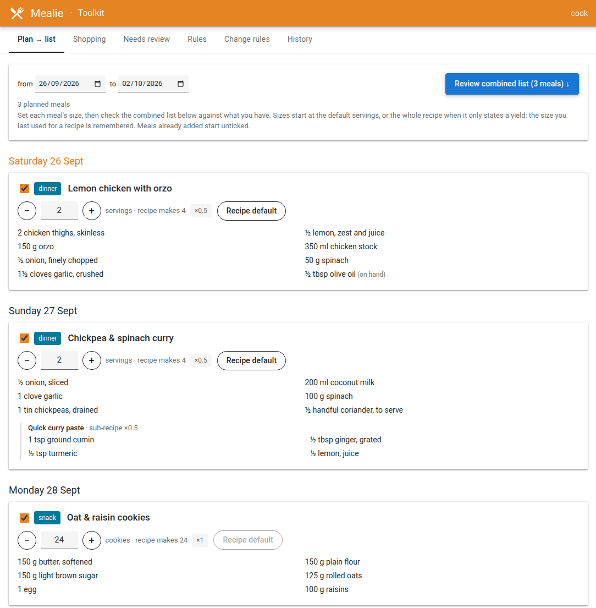
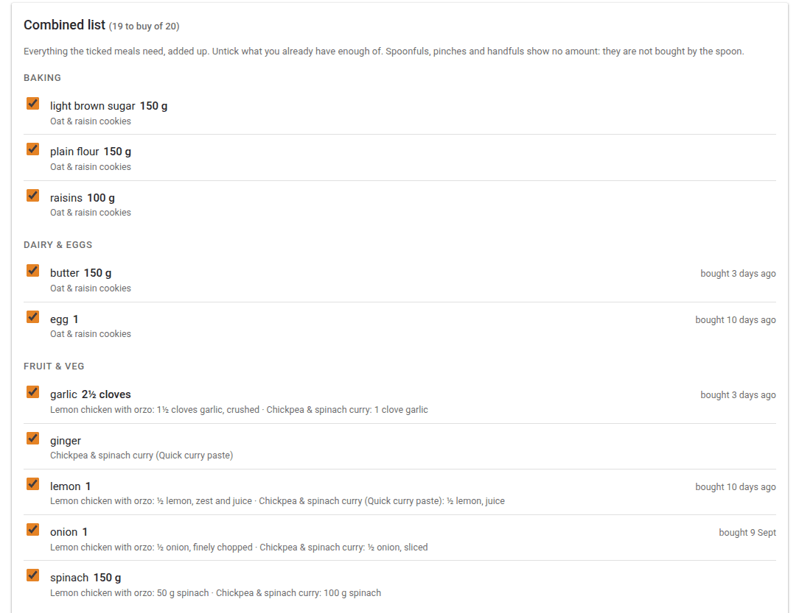

# mealie-toolkit

A companion service for a self-hosted [Mealie](https://mealie.io). It does two jobs:
finishes off recipes as they are imported (below), and serves the **Mealie Toolkit** page
on Mealie's own domain: meal plan to shopping list with per-meal sizes, what the meals to
come still need, the shopping export, finding well-rated BBC Good Food recipes to import,
the review queue and the processing rules
([The page](#the-page-mealie-toolkit-at-recipesdomaintoolkit)).



The recipe processing is done in code, with the judgement calls made by the local Qwen model
served by llama.cpp's llama-server (any OpenAI-compatible endpoint will do).

For every recipe imported from a URL it:

1. **Checks the scrape**: no ingredients, no method, placeholder text, or a step that stops
   mid-sentence. It rebuilds a broken import from the source page, using site-specific
   markup for deliciousmagazine.co.uk (which dropped its Recipe JSON-LD) and JSON-LD
   elsewhere.
2. **Fills nutrition** that Mealie missed, including saturated fat hidden inside the fat
   string (`"12.1g (2.1g saturated)"`), then shows the nutrition panel.
3. **Parses ingredients** into quantity / unit / food / note (Qwen). Section headings
   ("For the sauce") become Mealie section titles, and equipment rows are dropped.
4. **Matches every food and unit** onto existing Mealie records: plurals, `toasted sesame
   oil` → `sesame oil` + note, `litres` → `l`. A new food is created only when nothing
   matches, and never with prep words in its name. A new unit comes only from a fixed list
   (`ALLOWED_UNITS`) and is created with its plural (`tin` → `tins`; abbreviations such as
   `g` and `tbsp` have none).
5. **Files it**: one category, protein/season/character tags, and tools (Qwen), chosen only
   from Mealie's existing vocabulary. Rules in code, keyed on roles from the rules file
   rather than on names: slow cooker ⇒ winter, never both seasons, provenance tags never
   chosen, character tags like Savoury never on a main.
6. **Labels new foods** with their shopping aisle and plural form (Qwen) before creating them.

Anything it is unsure of is written as far as it safely can, and the recipe gets a
**Needs review** tag plus a note saying why. Rows it could not parse are left as written.

## How it is triggered

Mealie emits `recipe_created` through its notifier system (Apprise). A `json://` notifier
POSTs it to this service. Mealie's event is only a trigger, never the source of truth:

- a single-URL import sends the slug;
- a **bulk** URL import sends one event carrying only a report id, and sends it *before*
  scraping starts. The service polls the report until it finishes.

Either way the service waits `SETTLE_SECONDS`, then sweeps: any recipe with an `orgURL`,
created since the service first started, and not yet marked processed. A periodic sweep
(`SWEEP_MINUTES`) catches lost events. Hand-written recipes (no `orgURL`) are never touched.

"Processed" is recorded in the recipe's `extras` (`mealie-hook: <version> <time>`), so it
survives a lost `data/` directory.

### Safety

- **Edit guard**: if the recipe's `dateUpdated` changes while the model is working (you
  opened it and saved), the write is abandoned and retried on the next sweep.
- **Undo**: the recipe as it was before the write is saved under
  `data/snapshots/<slug>/`, and `undo <slug>` puts it back.
- **Additive**: categories, tags and tools are only ever added. Already-parsed ingredient
  rows are never touched.
- **Retry limit**: after `MAX_ATTEMPTS` failures (for example llama-server down) the recipe
  is marked processed and tagged Needs review with the error.
- **No thinking tokens**: each request sends `chat_template_kwargs: {enable_thinking:
  false}`, so the shared llama-server keeps its defaults. Typical cost is ~20s for
  ingredients plus ~3s to classify.

## The page: Mealie Toolkit, at recipes.<domain>/toolkit/

Served by this service, through Caddy, on Mealie's own domain, and styled to match Mealie
(its default theme, following the system's light or dark setting). It uses your Mealie login
(the `mealie.access_token` cookie, checked against Mealie on each request). Every Mealie user
gets the everyday tabs: Plan → list, Upcoming, Shopping and Discover. The curation tabs
(Needs review, Rules, Change rules, History) need Mealie's own **can organise** permission,
which admins have and which can be given to anyone under Mealie's user settings; for
everyone else they are hidden, and refused by the server. Changes made in Mealie go through
the service's own API token, so Mealie records them as that token's user; the service's
log records who actually made them.

It installs as its own app, next to Mealie's: open the page in Chrome on Android and use
**Add to Home Screen** (or **Install app**). It has its own icon, the Mealie fork and knife
with a tick, and opens full screen; the logo top left goes back to Mealie. Mealie's own
menu has no room for custom links, so this is the way in from a phone.



- **Upcoming** (the landing tab): what the meals still to cook need. Every planned meal from
  today on, at the size it was added to the shopping list with (Mealie's plan has no sizes,
  so Plan → list records each meal's), or the usual default for a meal not added yet. Each
  food's total is listed with which meals need it and when, spoonfuls included and whatever
  was bought. Type a food ("leek") for a straight answer: yes, how much and first needed
  when, or no, it's free to use in whatever is being cooked now. What is left is decided by
  date alone, so the planner should hold the day each meal is actually cooked; when that
  changes, **▲ ▼** swap a meal's day with the previous or next meal of the same type (dinner
  with dinner, so a snack never displaces a dinner), or move it a day when there is none,
  and tapping the day moves it to any date (with **Undo**). All of it writes straight to
  Mealie's planner, and is much easier on a phone than dragging in Mealie. A meal's size
  goes with it. Meals planned since the last shop (the latest tick-off seen) that have now
  passed are listed greyed, counting for nothing, so the plan can be straightened out after
  the fact; a different start date can be picked.
- **Plan → list**: replaces Mealie's "add planner to shopping list"
  dialog, in two steps.
  1. **Meals**: the planned meals between two dates (default: today plus six days), each
     with a tick to include it and a size. Recipes that state servings start at
     `PLAN_DEFAULT_SERVINGS` (2); recipes that only state a yield ("25 items", "6 cakes") or
     nothing start at the whole recipe. **−/+** changes the size and the listed ingredients
     follow; **Recipe default** goes back to the recipe's own size. The size last used for a
     recipe becomes its default next time. Sub-recipes appear as their own blocks at the
     parent's scale. Meals already added from this page are marked and start unticked, so a
     top-up shop does not add them twice.
  2. **Combined list**: every ingredient of the ticked meals added up per food, grouped by
     aisle, with where each amount comes from ("garlic 3½ cloves: 2 from one, 1½ from the
     other"). One tick per food means buy it; untick what you already have enough of. Foods
     marked on hand start unticked. Spoonfuls, pinches, handfuls, sprigs and knobs show no
     amount, since they are not bought by the spoon. On the right, muted, is when the food
     was last bought.

  **Add** goes through Mealie's own add-recipe endpoint with each meal's scale and only the
  ingredients still ticked, so items merge and Mealie's recipe references (and "remove
  recipe" on the list) work as usual. One Mealie quirk: when a recipe lists the same food
  twice, Mealie adds the second one unscaled, so its amount on Mealie's list is off for any
  size other than ×1 (the combined list is right).

  **Last bought** means last ticked off a shopping list. Every load of this tab or Shopping
  copies Mealie's ticked items (their food and tick time) into `data/state.json`, so the
  record outlives Mealie's "delete checked items". Home Assistant items count only when
  ticked from the Shopping tab, matched to a food by name or plural.
- **Shopping**: the Mealie shopping list and Home Assistant's, merged into one list of
  shoppable names for pasting into a supermarket search. Home Assistant items a Mealie item
  already covers are crossed out. **Copy** puts the list on the clipboard. **Tick all
  off** ticks exactly the items shown in both places; anything added since the page loaded
  is left alone.
  Forgot to tick off after a shop? Set **added since** to that shop's date: Mealie items
  last added to before it move to a "probably bought already" group, drop out of the
  export, and get their own **Tick off these** button. An item topped up by a later recipe
  counts as new. Home Assistant items have no dates, so they always stay in the export. The
  page shows when you last ticked off, as a reminder.
- **Discover**: finds well-rated BBC Good Food recipes to import. It uses Good Food's own
  search and filters (meal type, diet, minimum stars, time, cuisine, difficulty, sorted by
  most popular by default) and drops paywalled premium recipes. Each result's page is read
  for sat fat, calories, servings and time, which the per-serving limits filter on (Good
  Food publishes no cholesterol figures). Pages are cached for 30 days in
  `data/discover-cache.json`, and recipes already in Mealie (matched on source URL) are
  hidden. **Import** hands the ticked recipes to Mealie's bulk URL importer, so they are then
  processed like any other import. The filters are remembered in the browser.
- **Needs review**: flagged recipes with their reasons, linked into Mealie. **Mark
  reviewed** removes the tag and the note.
- **Rules**: every category, tag, tool and aisle with its guidance and roles, the prompts
  (plus "what Qwen sees" once the vocabulary is filled in), and mismatches with Mealie, e.g. a
  tag with no guidance, a vocabulary name Mealie lacks (with a **Create in Mealie**
  button), or a code rule disabled because its role has no live name. Files can also be
  edited by hand.
- **Change rules**: describe a change in plain words; Qwen proposes an edit, which is checked
  and shown as a diff. **Try on recipe** runs it on a filed recipe without writing
  anything; **Apply** saves it. New names come with a one-click "create in Mealie"; nothing
  is ever renamed or deleted in Mealie.
- **History**: every change, with its diff and **Revert to before this**. A revert is
  itself recorded.

### The rules

`rules/` in this repo holds the shipped defaults. On first start they are copied to
`data/rules/`, which is the live copy the page edits. The service reads it on every recipe,
so edits apply immediately, with no redeploy, and image rebuilds never overwrite it.

- `vocabulary.toml`: guidance and roles for each Mealie organizer. Mealie supplies the
  names (the model can only choose names that exist); this file says what they mean.
- `classify.md`, `labels.md`, `ingredients.md`: the prompts. `{{categories}}`, `{{tags}}`,
  `{{tools}}` and `{{labels}}` are filled from the vocabulary and must stay.

## Layout

```
mealie_toolkit/
  __main__.py     CLI
  server.py       worker (settle, bulk-report wait, periodic sweep) + event parsing
  web.py          FastAPI: internal /hook, and the /ui page + API (Mealie-login auth)
  pipeline.py     per-recipe pipeline, sweep, and replay (try rules on a filed recipe)
  rules.py        vocabulary + prompt templates: store, render, drift, history
  chat.py         rules editing via Qwen: proposal -> validate -> diff
  editor.md       the rules editor's own instructions (not editable from the page)
  shopping.py     Mealie + Home Assistant shopping export and tick-off
  planner.py      Plan -> list: the meal plan, scaled per meal, onto a shopping list
  upcoming.py     Upcoming: ingredients still needed by the meals to come
  discover.py     Discover: Good Food search, per-recipe nutrition, bulk import
  bought.py       when each food was last bought (ticked off a list)
  review.py       the Needs review queue
  scrape.py       scrape checks, page extraction (BeautifulSoup), nutrition
  ingredients.py  model call + deterministic post-processing
  foods.py        food/unit matching, plurals, prep-word guard
  classify.py     category/tags/tools + role-based rules
  labels.py       aisle + plural for new foods
  models.py       pydantic models: the LLM JSON schemas and their validators
  evaluate.py     replay processed recipes and score agreement
  export.py       tracking JSON files from Mealie's state
  ui/index.html   the page (no build step)
  mealie.py llm.py config.py state.py
rules/            shipped default rules
tests/            offline tests (fake Mealie, fake model, FastAPI test client)
```

## Deploy

The deploy script assumes a host running rootless Podman and
[Dockge](https://github.com/louislam/dockge), with compose stacks under `~/compose`, reached
over ssh. Set the ssh host once in a gitignored `deploy.local` (`HOST=myserver`), or pass
`HOST=...` on each run.

One-time setup:

```bash
HOST=myserver
ssh $HOST 'mkdir -p ~/compose/mealie-toolkit'
# create an API token in Mealie (Profile -> API Tokens, name "mealie-toolkit"), then:
ssh $HOST 'cat > ~/compose/mealie-toolkit/.env && chmod 600 ~/compose/mealie-toolkit/.env' <<< 'MEALIE_TOKEN=...'
```

For the Shopping tab, add Home Assistant to the same `.env` (optional):

```
HA_URL=https://home.example.com
HA_TOKEN=<long-lived access token>
```

Then, from this directory, and again after every change:

```bash
./deploy.sh        # rsync -> podman build on the host -> docker compose up -d (via Dockge)
```

Finally point Mealie's notifier at it (creates or updates one named `mealie-toolkit`, enabled,
firing on **Recipe Created** only):

```bash
ssh $HOST 'podman exec mealie-toolkit python -m mealie_toolkit notifier --create'
```

(In the UI it lives under Settings → Household → Notifiers; `--delete` removes it.)

The container joins the `mealie_default` network (for Mealie) and `proxy` (for Caddy). It
publishes no port, and reaches llama-server at `host.containers.internal:8080`.

Caddy serves the page on Mealie's domain; only `/ui` is exposed, never `/hook`:

```
recipes.example.com {
    redir /toolkit /toolkit/
    handle_path /toolkit/* {
        rewrite * /ui{path}
        reverse_proxy mealie-toolkit:8000
    }
    handle {
        reverse_proxy mealie:9000
    }
}
```

## Operating

```bash
C='podman exec mealie-toolkit python -m mealie_toolkit'
ssh $HOST "$C candidates"                    # what the next sweep would take
ssh $HOST "$C process SLUG --dry"            # full pipeline, print result, write nothing
ssh $HOST "$C process SLUG --force"          # (re)process one recipe now, even an old one
ssh $HOST "$C undo SLUG"                     # restore the pre-edit snapshot
ssh $HOST "$C eval 20"                       # agreement vs 20 already-filed recipes
ssh $HOST "$C export /data/export"           # tracking JSON -> ~/compose/mealie-toolkit/data/export
ssh $HOST 'podman logs -f mealie-toolkit'
ssh $HOST 'podman exec mealie-toolkit python -c "import urllib.request as u;print(u.urlopen(\"http://localhost:8000/health\").read().decode())"'
```

Filter by the **Needs review** tag in Mealie to see what needs a human. Delete the tag
and the "Needs review (mealie-hook)" note once you have checked a recipe.

Set `DRY_RUN=true` in `.env` to run the whole thing on real events without writing.

## Measured (2026-09-26, Qwen3.5-35B-A3B Q8_0, thinking off)

Against 20 recipes already parsed and filed by hand (`eval 20`): **91%** of 222 ingredient
rows matched on every field (food 93%, unit 99%, quantity 99%, section titles 100%);
category **19/20**; tags precision 71%, recall 84%. Most food "misses" are synonym choices
(`potato` for `new potato`, `garlic powder` for `garlic granules`); seasons are the least
reliable tag. About 15-35s per recipe. End-to-end tested live, including recipes whose foods
were not in the database (new foods created with aisle and plural), bulk imports, and
the Apprise delivery.

Two Mealie/Apprise quirks the code handles, both found in live testing:

- `document_data` arrives URL-encoded (`{"reportId":+"..."}`), because Mealie encodes it into
  the Apprise URL and Apprise never decodes it.
- A bulk import's single event arrives before scraping starts; the service waits on the
  report (`GET /groups/reports/{id}`) before sweeping.

## Development

```bash
python -m venv .venv && .venv/bin/pip install -e '.[dev]'
.venv/bin/pytest
```

The rules are the main tuning surface: change them from the page, then run `eval` to measure
the effect against the recipes already in the collection.
